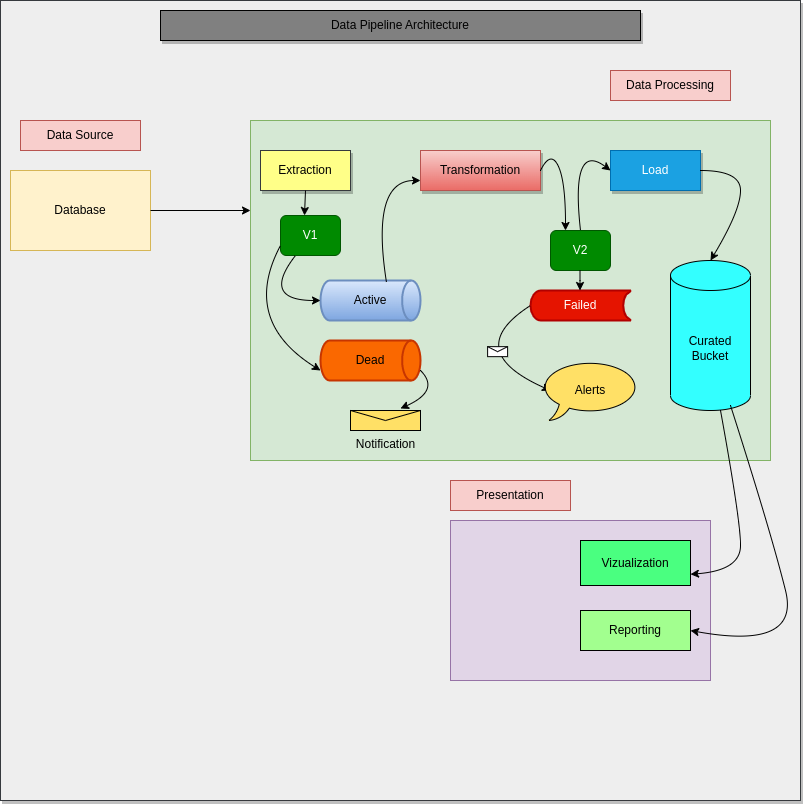

# DataPlump

DataPlump is an end to end data pipeline comprising of three major sections namely data source, data processing and data presentation. Data source compounds data collection point in this case a database, data processing comprises data extraction, transformation and loading while data presentation entails vizualization and reporting.

## Pipeline Structure

### Data Source
Data source is a sql data base containing raw data that shall be used in this data pipeline.

### Data Processing
Data processing bounds typical ETL processes:
   #### Extraction
    Data is ingested from the database into a Kafka broker, which acts as a message broker. There are two topics created from which producers publishes into. Validated
    data is written into active topic while invalidated ones are stored in a dead letter topic. A notification for further action is generated to deal with invalidated data.

   #### Transformation
    Transformation consumes data from active topic. The data is cleaned, wrangled, munged and enriched into desired state. This process is done using such big data tools as spark, pandas and sql. Once processed, the data output undergoes further validation to determine its readiness for business use. Failed transformations are pushed to failed data store and a notification alert is raised.

   #### Loading
    This stage entails loading validated data from transformation stage into a curated bucket. This could be a datawarehouse or datalake etc. The data loaded is clean, in good format and mmet all the standards  set for this stage.

### Presentation
Presentation section comprise reporting and visualization:
   #### Visualization
    This is a detailed presentation of data in a graphical manner. Vizualization offers indespensable insights for decision makers.

   #### Reporting
    Reporting offers ad hoc yet summarised key details about data.

## Conclusion
This is a basic structure for an end-to-end data pipeline project.